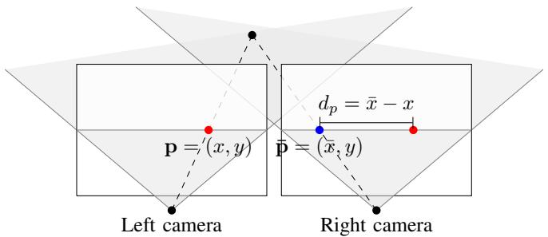
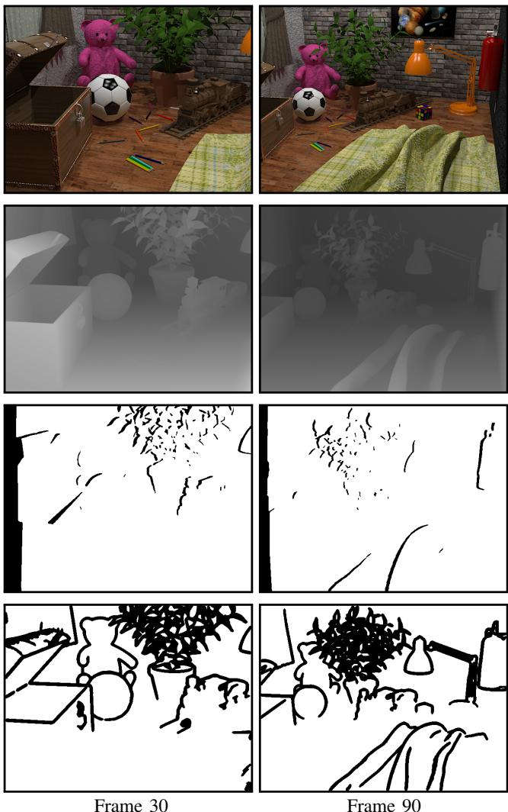
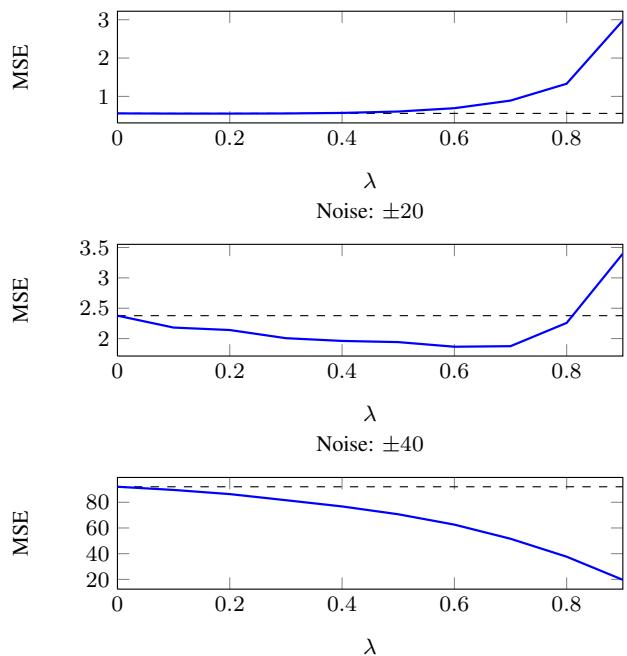
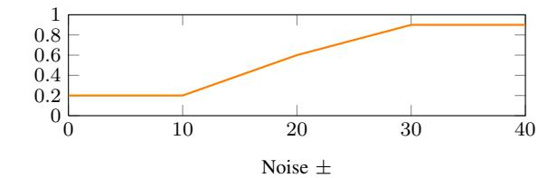
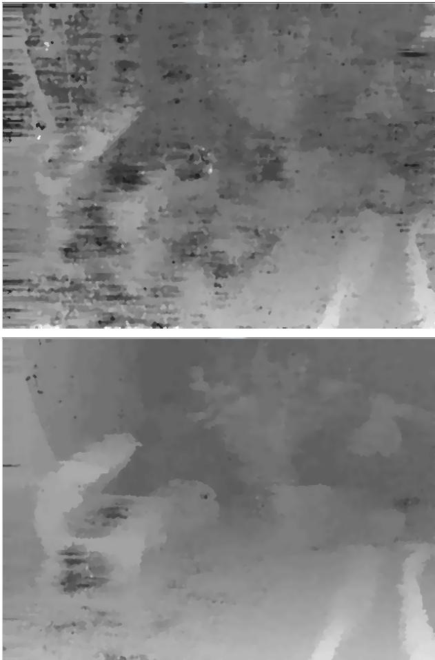

# Real-time Temporal Stereo Matching using Iterative Adaptive Support Weights

J˛edrzej Kowalczuk, Eric T. Psota, and Lance C. Pérez Department of Electrical Engineering, University of Nebraska-Lincoln [jkowalczuk2,epsota,lperez]@unl.edu

Abstract—Stereo matching algorithms are nearly always designed to find matches between a single pair of images. A method is presented that was specifically designed to operate on sequences of images. This method considers the cost of matching image points in both the spatial and temporal domain. To maintain real-time operation, a temporal cost aggregation method is used to evaluate the likelihood of matches that is invariant with respect to the number of prior images being considered. This method has been implemented on massively parallel GPU hardware, and the implementation ranks as one of the fastest and most accurate real-time stereo matching methods as measured by the Middlebury stereo performance benchmark.

# I. INTRODUCTION

Modern stereo matching algorithms achieve excellent results on static stereo images, as demonstrated by the Middlebury stereo performance benchmark [1], [2]. However, their application to stereo video sequences does not guarantee interframe consistency of matches extracted from subsequent stereo frame pairs. The lack of temporal consistency of matches between successive frames introduces spurious artifacts in the resulting disparity maps. The problem of obtaining temporally consistent sequences of disparity maps from video streams is known as the temporal stereo correspondence problem, yet the amount of research efforts oriented towards finding an effective solution to this problem is surprisingly small.

A method is proposed for real-time temporal stereo matching that efficiently propagates matching cost information between consecutive frames of a stereo video sequence. This method is invariant to the number of prior frames being considered, and can be easily incorporated into any local stereo method based on edge-aware filters. The iterative adaptive support matching algorithm presented in [3] serves as a foundation for the proposed method.

# II. BACKGROUND

Stereo matching is the process of identifying correspondences between pixels in stereo images obtained using a pair of synchronized cameras. These correspondences are conveniently represented using the notion of disparity, i.e. the positional offset between two matching pixels. It is assumed that the stereo images are rectified, such that matching pixels are confined within corresponding rows of the images and thus disparities are restricted to the horizontal dimension, as illustrated in Figure 1. For visualization purposes, disparities recovered for every pixel of a reference image are stored together in the form of an image, which is known as the disparity map. Note that individual disparities can be converted to actual depths if the geometry of the camera setup is known, i.e., the stereo configuration of cameras has been precalibrated.

  
Figure 1: Geometry of two horizontally aligned views where $\mathbf { p }$ denotes a pixel in the reference frame, $\bar { \bf p }$ denotes its matching pixel in the target frame, and $d _ { p }$ denotes the disparity between them along the horizontal dimension.

In their excellent taxonomy paper [1], Scharstein and Szeliski classify stereo algorithms as local or global methods. Global methods, which offer outstanding accuracy, are typically derived from an energy minimization framework that allows for explicit integration of disparity smoothness constraints and thus is capable of regularizing the solution in weakly textured areas. The minimization, however, is often achieved using iterative methods or graph cuts, which do not lend themselves well to parallel implementation.

In contrast, local methods, which are typically built upon the Winner-Takes-All (WTA) framework, have the property of computational regularity and are thus suitable for implementation on parallel graphics hardware. Within the WTA framework, local stereo algorithms consider a range of disparity hypotheses and compute a volume of pixel-wise dissimilarity metrics between the reference image and the matched image at every considered disparity value. Final disparities are chosen from the cost volume by traversing through its values and selecting the disparities associated with minimum matching costs for every pixel of the reference image.

Disparity maps obtained using this simple strategy are often too noisy to be considered useable. To reduce the effects of noise and enforce spatial consistency of matches, local stereo algorithms consider arbitrarily shaped and sized support windows centered at each pixel of the reference image, and aggregate cost values within the pixel neighborhoods defined by these windows. In 2005, Yoon and Kweon [4] proposed an adaptive matching cost aggregation scheme, which assigns a weight value to every pixel located in the support window of a given pixel of interest. The weight value is based on the spatial and color similarity between the pixel of interest and a pixel in its support window, and the aggregated cost is computed as a weighted average of the pixel-wise costs within the considered support window. The edge-preserving nature and matching accuracy of adaptive support weights have made them one of the most popular choices for cost aggregation in recently proposed stereo matching algorithms [3], [5]–[8].

Recently, Rheman et al. [9], [10] have revisited the cost aggregation step of stereo algorithms, and demonstrated that cost aggregation can be performed by filtering of subsequent layers of the initially computed matching cost volume. In particular, the edge-aware image filters, such as the bilateral filter of Tomasi and Manducci [11] or the guided filter of He [12], have been rendered useful for the problem of matching cost aggregation, enabling stereo algorithms to correctly recover disparities along object boundaries. In fact, Yoon and Kweon’s adaptive support-weight cost aggregation scheme is equivalent to the application of the so-called joint bilateral filter to the layers of the matching cost volume.

It has been demonstrated that the performance of stereo algorithms designed to match a single pair of images can be adapted to take advantage of the temporal dependencies available in stereo video sequences. Early proposed solutions to temporal stereo matching attempted to average matching costs across subsequent frames of a video sequence [13], [14]. Attempts have been made to integrate estimation of motion fields (optical flow) into temporal stereo matching. The methods of [15] and [16] perform smoothing of disparities along motion vectors recovered from the video sequence. The estimation of the motion field, however, prevents real-time implementation, since state-of-the-art optical flow algorithms do not, in general, approach real-time frame rates. In a related approach, Sizintsev and Wildes [17], [18] used steerable filters to obtain descriptors characterizing motion of image features in both space and time. Unlike traditional algorithms, their method performs matching on spatio-temporal motion descriptors, rather than on pure pixel intensity values, which leads to improved temporal coherence of disparity maps at the cost of reduced accuracy at depth discontinuities.

Most recently, local stereo algorithms based on edge-aware filters were extended to incorporate temporal evidence into the matching process. The method of Richardt et al. [19] employs a variant of the bilateral grid [20] implemented on graphics hardware, which accelerates cost aggregation and allows for weighted propagation of pixel dissimilarity metrics from previous frames to the current one. Although this method outperforms the baseline frame-to-frame approach, the amount of hardware memory necessary to construct the bilateral grid limits its application to single-channel, i.e., grayscale images only. Hosni et al. [10], on the other hand, reformulated kernels of the guided image filter to operate on both spatial and temporal information, making it possible to process a temporal collection of cost volumes. The filtering operation was shown to preserve spatio-temporal edges present in the cost volumes, resulting in increased temporal consistency of disparity maps, greater robustness to image noise, and more accurate behavior around object boundaries.

# III. METHOD

The proposed temporal stereo matching algorithm is an extension of the real-time iterative adaptive support-weight algorithm described in [3]. In addition to real-time twopass aggregation of the cost values in the spatial domain, the proposed algorithm enhances stereo matching on video sequences by aggregating costs along the time dimension. The operation of the algorithm has been divided into four stages: 1) two-pass spatial cost aggregation, 2) temporal cost aggregation, 3) disparity selection and confidence assessment, and 4) iterative disparity refinement. In the following, each of these stages is described in detail.

# A. Two-Pass Spatial Cost Aggregation

Humans group shapes by observing the geometric distance and color similarity of points in space. To mimic this visual grouping, the adaptive support-weight stereo matching algorithm [4] considers a support window $\Omega _ { p }$ centered at the pixel of interest $p$ , and assigns a support weight to each pixel $q \in \Omega _ { p }$ . The support weight relating pixels $p$ and $q$ is given by

$$
w ( p , q ) = \exp { \left( - \frac { \Delta _ { g } ( p , q ) } { \gamma _ { g } } - \frac { \Delta _ { c } ( p , q ) } { \gamma _ { c } } \right) } ,
$$

where $\Delta _ { g } ( p , q )$ is the geometric distance, $\Delta _ { c } ( p , q )$ is the color difference between pixels $p$ and $q$ , and the coefficients $\gamma _ { g }$ and $\gamma _ { c }$ regulate the strength of grouping by geometric distance and color similarity, respectively.

To identify a match for the pixel of interest $p$ , the real-time iterative adaptive support-weight algorithm evaluates matching costs between $p$ and every match candidate $\bar { p } \in S _ { p }$ , where $S _ { p }$ denotes a set of matching candidates associated with pixel $p$ . For a pair of pixels $p$ and $\bar { p }$ , and their support windows $\Omega _ { p }$ and $\Omega _ { \bar { p } }$ , the initial matching cost is aggregated using

$$
C ( p , \bar { p } ) = \frac { { \displaystyle \sum _ { q \in \Omega _ { p } , \bar { q } \in \Omega _ { \bar { p } } } w ( p , q ) w ( \bar { p } , \bar { q } ) \delta ( q , \bar { q } ) } } { { \displaystyle \sum _ { q \in \Omega _ { p } , \bar { q } \in \Omega _ { \bar { p } } } w ( p , q ) w ( \bar { p } , \bar { q } ) } } ,
$$

where the pixel dissimilarity metric $\delta ( q , \bar { q } )$ is chosen as the sum of truncated absolute color differences between pixels $q$ and $\bar { q }$ . Here, the truncation of color difference for the red, green, and blue components given by

$$
\delta ( q , \bar { q } ) = \sum _ { c = \{ r , g , b \} } \operatorname* { m i n } ( | q _ { c } - \bar { q } _ { c } | , \tau ) .
$$

This limits each of their magnitudes to at most $\tau$ , which provides additional robustness to outliers. Rather than evaluating Equation (2) directly, real-time algorithms often approximate the matching cost by performing two-pass aggregation using two orthogonal 1D windows [5], [6], [8]. The two-pass method first aggregates matching costs in the vertical direction, and then computes a weighted sum of the aggregated costs in the horizontal direction. Given that support regions are of size $\omega \times \omega$ , the two-pass method reduces the complexity of cost aggregation from $\mathcal { O } ( \omega ^ { 2 } )$ to $\mathcal { O } ( \omega )$ .

# B. Temporal cost aggregation

Once aggregated costs $C ( p , \bar { p } )$ have been computed for all pixels $p$ in the reference image and their respective matching candidates $\bar { p }$ in the target image, a single-pass temporal aggregation routine is exectuted. At each time instance, the algorithm stores an auxiliary cost $C _ { a } ( p , \bar { p } )$ which holds a weighted summation of costs obtained in the previous frames. During temporal aggregation, the auxiliary cost is merged with the cost obtained from the current frame using

$$
C ( p , \bar { p } ) \gets \frac { ( 1 - \lambda ) \cdot C ( p , \bar { p } ) + \lambda \cdot w _ { t } ( p , p _ { t - 1 } ) \cdot C _ { a } ( p , \bar { p } ) } { ( 1 - \lambda ) + \lambda \cdot w _ { t } ( p , p _ { t - 1 } ) } ,
$$

where the feedback coefficient $\lambda$ controls the amount of cost smoothing and $w _ { t } ( p , p _ { t - 1 } )$ enforces color similarity in the temporal domain. The temporal adaptive weight computed between the pixel of interest $p$ in the current frame and pixel $p _ { t - 1 }$ , located at the same spatial coordinate in the prior frame, is given by

$$
w _ { t } ( p , p _ { t - 1 } ) = \exp { \left( - \frac { \Delta _ { c } ( p , p _ { t - 1 } ) } { \gamma _ { t } } \right) } ,
$$

where $\gamma _ { t }$ regulates the strength of grouping by color similarity in the temporal dimension. The temporal adaptive weight has the effect of preserving edges in the temporal domain, such that when a pixel coordinate transitions from one side of an edge to another in subsequent frames, the auxiliary cost is assigned a small weight and the majority of the cost is derived from the current frame.

# C. Disparity Selection and Confidence Assessment

Having performed temporal cost aggregation, matches are determined using the Winner-Takes-All (WTA) match selection criteria. The match for $p$ , denoted as $m ( p )$ , is the candidate pixel $\bar { p } \in S _ { p }$ characterized by the minimum matching cost, and is given by

$$
m ( p ) = \operatorname * { a r g m i n } _ { \bar { p } \in S _ { p } } C ( p , \bar { p } ) .
$$

To asses the level of confidence associated with selecting minimum cost matches, the algorithm determines another set of matches, this time from the target to reference image, and verifies if the results agree. Given that $\bar { p } = m ( p )$ , i.e. pixel $\bar { p }$ in the right image is the match for pixel $p$ in the left image, and $p ^ { \prime } = m ( \bar { p } )$ , the confidence measure $F _ { p }$ is computed as

$$
F _ { p } = \left\{ \begin{array} { l l } { \displaystyle \operatorname* { m i n } _ { \bar { p } \in S _ { p } \backslash m ( p ) } C ( p , \bar { p } ) - \operatorname* { m i n } _ { \bar { p } \in S _ { p } } C ( p , \bar { p } ) } \\ { \displaystyle \operatorname* { m i n } _ { \bar { p } \in S _ { p } \backslash m ( p ) } C ( p , \bar { p } ) } ,  & { | d _ { p } - d _ { p ^ { \prime } } | \leq 1 } \\ { 0 , } & { \mathrm { o t h e r w i s e } } \end{array} \right. .
$$

# D. Iterative Disparity Refinement

Once the first iteration of stereo matching is complete, disparity estimates $D _ { \boldsymbol { p } } ^ { i }$ can be used to guide matching in subsequent iterations. This is done by penalizing disparities that deviate from their expected values. The penalty function is given by

$$
\Lambda ^ { i } ( p , \bar { p } ) = \alpha \times \sum _ { q \in \Omega _ { p } } w ( p , q ) F _ { q } ^ { i - 1 } \left| D _ { q } ^ { i - 1 } - d _ { p } \right| ,
$$

where the value of $\alpha$ is chosen empirically. Next, the penalty values are incorporated into the matching cost as

$$
{ C } ^ { i } ( p , \bar { p } ) = { C } ^ { 0 } ( p , \bar { p } ) + { \Lambda } ^ { i } ( p , \bar { p } ) ,
$$

and the matches are reselected using the WTA match selection criteria. The resulting disparity maps are then post-processed using a combination of median filtering and occlusion filling. Finally, the current cost becomes the auxiliary cost for the next pair of frames in the video sequence, i.e., $C _ { a } ( p , \bar { p } )  C ( p , \bar { p } )$ for all pixels $p$ in the and their matching candidates $\bar { p }$ .

# IV. RESULTS

The speed and accuracy of real-time stereo matching algorithms are traditionally demonstrated using still-frame images from the Middlebury stereo benchmark [1], [2]. Still frames, however, are insufficient for evaluating stereo matching algorithms that incorporate frame-to-frame prediction to enhance matching accuracy. An alternative approach is to use a stereo video sequence with a ground truth disparity for each frame. Obtaining the ground truth disparity of real world video sequences is a difficult undertaking due to the high frame rate of video and limitations in depth sensingtechnology. To address the need for stereo video with ground truth disparities, five pairs of synthetic stereo video sequences of a computer-generated scene were given in [19]. While these videos incorporate a sufficient amount of movement variation, they were generated from relatively simple models using lowresolution rendering, and they do not provide occlusion or discontinuity maps.

To evaluate the performance of temporal aggregation, a new synthetic stereo video sequence is introduced along with corresponding disparity maps, occlusion maps, and discontinuity maps for evaluating the performance of temporal stereo matching algorithms. To create the video sequence, a complex scene was constructed using Google Sketchup and a pair of animated paths were rendered photorealistically using the Kerkythea rendering software. Realistic material properties were used to give surfaces a natural-looking appearance by adjusting their specularity, reflectance, and diffusion. The video sequence has a resolution of $6 4 0 ~ \times ~ 4 8 0$ pixels, a frame rate of 30 frames per second, and a duration of 4 seconds. In addition to performing photorealistic rendering, depth renders of both video sequences were also generated and converted to ground truth disparity for the stereo video. The video sequences and ground truth data have been made available at http://mc2.unl.edu/current-research /image-processing/. Figure 2 shows two sample frames of the synthetic stereo scene from a single camera perspective, along with the ground truth disparity, occlusion map, and discontinuity map.

The results of temporal stereo matching are given in Figure 3 for uniform additive noise confined to the ranges of $\pm 0$ , $\pm 2 0$ , and $\pm 4 0$ . Each performance plot is given as a function of the feedback coefficient $\lambda$ . As with the majority of temporal stereo matching methods, improvements are negligible when no noise is added to the images [10], [19]. This is largely due to the fact that the video used to evaluate these methods is computer generated with very little noise to start with, thus the noise suppression achieved with temporal stereo matching shows little to no improvement over methods that operate on pairs of images.

Significant improvements in accuracy can be seen in Figure 3 when the noise has ranges of $\pm 2 0$ , and $\pm 4 0$ . In this scenario, the effect of noise in the current frame is reduced by increasing the feedback coefficient $\lambda$ . This increasing of $\lambda$ has the effect of averaging out noise in the per-pixel costs by selecting matches based more heavily upon the auxiliary cost, which is essentially a much more stable running average of the cost over the most recent frames. By maintaining a reasonably high value of $\gamma _ { t }$ , the auxiliary cost also preserves temporal edges, essentially reducing over-smoothing of a pixel’s disparity when a pixel transitions from one depth to another in subsequent frames.

  
Figure 3: Performance of temporal matching at different levels of uniformly distributed image noise $\{ \pm 0 , \pm 2 0 , \pm 4 0 \}$ . Mean squared error (MSE) of disparities is plotted versus the values of the feedback coefficient $\lambda$ . Dashed lines correspond to the values of MSE obtained without temporal aggregation.

Table I: Parameters used in the evaluation of real-time temporal stereo matching.   

<html><body><table><tr><td>Symbol</td><td>Description</td><td>Value</td></tr><tr><td>ω</td><td>Window size for cost aggregation</td><td>33</td></tr><tr><td>T</td><td>Color difference truncation value</td><td>40</td></tr><tr><td>γc</td><td>Strength of grouping by color similarity 1</td><td>0.03</td></tr><tr><td>γg</td><td>Strength of grouping by proximity</td><td>0.03</td></tr><tr><td>λ</td><td>Temporal feedback coeffi cient</td><td>varied</td></tr><tr><td>γt</td><td>Strength of temporal grouping</td><td>0.01</td></tr><tr><td>k</td><td>Number of iterations in refinement stage</td><td>3</td></tr><tr><td></td><td>Disparity difference penalty</td><td>0.08</td></tr></table></body></html>

1 To enable propagation of disparity information in the iterative refinement stage, the values of $\gamma _ { c }$ and $\gamma _ { g }$ were set to 0.09 and 0.01, respectively.

  
Figure 2: Two sample frames from the synthetic video sequence ( $1 ^ { \mathrm { s t } }$ row), along with their corresponding ground truth disparity ( $2 ^ { \mathrm { n d } }$ row), occlusion map ( $3 ^ { \mathrm { r d } }$ row), and discontinuity map $\mathrm { \cdot } 4 ^ { \mathrm { t h } }$ row).   
Figure 4: Optimal values of the feedback coefficient $\lambda$ corresponding to the smallest mean squared error (MSE) of the disparity estimates for a range of noise strengths.

  
Figure 5: A comparison of stereo matching without temporal cost aggregation (top) and with temporal cost aggregation (bottom) for a single frame in the synthetic video sequence where the noise is $\pm 3 0$ and the feedback coefficient is $\lambda = 0 . 8$

The optimal value of the feedback coefficient is largely dependent on the noise being added to the image. Figure 4 shows the optimal values of $\lambda$ for noise ranging between $\pm 0$ to $\pm 4 0$ . As intuition would suggest, it is more beneficial to rely on the auxiliary cost when noise is high and it is more beneficial to rely on the current cost when noise is low. Figure 5 illustrates the improvements that are achieved when applying temporal stereo matching to a particular pair of frames in the synthetic video sequence. Clearly, the noise in the disparity map is drastically reduced when temporal stereo matching is used.

The algorithm was implement using NVIDIA’s Compute Unified Device Architecture (CUDA). The details of the implementation are similar to those given in [3]. When compared to other existing real-time stereo matching implementations, the proposed implementation achieves the highest speed of operation measured by the number of disparity hypotheses evaluated per second, as shown in Table II. It is also the second most accurate real-time method in terms of error rate, as measured using the Middlebury stereo evaluation benchmark. It should be noted that it is difficult to establish an unbiased metric for speed comparisons, as the architecture, number of cores, and clock speed of graphics hardware used are not consistent across implementations.

Table II: A comparison of speed and accuracy for the implementations of many leading real-time stereo matching methods.

<html><body><table><tr><td>Method</td><td>GPU</td><td>MDE/s</td><td>FPS2d:</td><td>Error</td></tr><tr><td>Our Method</td><td>GeForce GTX 680</td><td>215.7</td><td>90</td><td>6.20</td></tr><tr><td>CostFilter [10]</td><td>GeForce GTX 480</td><td>57.9</td><td>24</td><td>5.55</td></tr><tr><td>FastBilateral [7]</td><td>Tesla C2070</td><td>50.6</td><td>21</td><td>7.31</td></tr><tr><td>RealtimeBFV [8]</td><td>GeForce 8800 GTX</td><td>114.3</td><td>46</td><td>7.65</td></tr><tr><td>RealtimeBP [21]</td><td>GeForce 7900 GTX</td><td>20.9</td><td>8</td><td>7.69</td></tr><tr><td>ESAW [6]</td><td>GeForce 8800 GTX</td><td>194.8</td><td>79</td><td>8.21</td></tr><tr><td>ReaITimeGPU [5]</td><td>Radeon XL1800</td><td>52.8</td><td>21</td><td>9.82</td></tr><tr><td>DCBGrid [19]</td><td>Quadro FX 5800</td><td>25.1</td><td>10</td><td>10.90</td></tr></table></body></html>

1 Millions of Disparity Estimates per Second. 2 Assumes $3 2 0 \times 2 4 0$ images with 32 disparity levels. 3 As measured by the Middlebury stereo performance benchmark using the avgerage $\%$ of bad pixels.

# V. CONCLUSION

While the majority of stereo matching algorithms focus on achieving high accuracy on still images, the volume of research aimed at recovery of temporally consistent disparity maps remains disproportionally small. This paper introduces an efficient temporal cost aggregation scheme that can easily be combined with conventional spatial cost aggregation to improve the accuracy of stereo matching when operating on video sequences. A synthetic video sequence, along with ground truth disparity data, was generated to evaluate the performance of the proposed method. It was shown that temporal aggregation is significantly more robust to noise than a method that only considers the current stereo frames.

# REFERENCES

[1] D. Scharstein and R. Szeliski, “A taxonomy and evaluation of dense two-frame stereo correspondence algorithms,” International Journal of Computer Vision, vol. 47, pp. 7–42, April-June 2002.   
[2] D. Scharstein and R. Szeliski, “High-accuracy stereo depth maps using structured light,” in In IEEE Computer Society Conference on Computer Vision and Pattern Recognition, vol. 1, pp. 195–202, June 2003.   
[3] J. Kowalczuk, E. Psota, and L. Perez, “Real-time stereo matching on CUDA using an iterative refinement method for adaptive support-weight correspondences,” Circuits and Systems for Video Technology, IEEE Transactions on, vol. 23, pp. 94 –104, Jan. 2013.   
[4] K.-J. Yoon and I.-S. Kweon, “Locally adaptive support-weight approach for visual correspondence search,” in CVPR ’05: Proceedings of the 2005 IEEE Computer Society Conference on Computer Vision and Pattern Recognition (CVPR’05) - Volume 2, (Washington, DC, USA), pp. 924– 931, IEEE Computer Society, 2005.   
[5] L. Wang, M. Liao, M. Gong, R. Yang, and D. Nister, “High-quality realtime stereo using adaptive cost aggregation and dynamic programming,” in 3DPVT ’06: Proceedings of the Third International Symposium on 3D Data Processing, Visualization, and Transmission (3DPVT’06), (Washington, DC, USA), pp. 798–805, IEEE Computer Society, 2006.   
[6] W. Yu, T. Chen, F. Franchetti, and J. C. Hoe, “High performance stereo vision designed for massively data parallel platforms,” Circuits and Systems for Video Technology, IEEE Transactions on, vol. 20, pp. 1509 –1519, November 2010. [7] S. Mattoccia, M. Viti, and F. Ries, “Near real-time fast bilateral stereo on the GPU,” in Computer Vision and Pattern Recognition Workshops (CVPRW), 2011 IEEE Computer Society Conference on, pp. 136 –143, June 2011. [8] K. Zhang, J. Lu, Q. Yang, G. Lafruit, R. Lauwereins, and L. Van Gool, “Real-time and accurate stereo: A scalable approach with bitwise fast voting on CUDA,” Circuits and Systems for Video Technology, IEEE Transactions on, vol. 21, pp. 867 –878, July 2011.   
[9] C. Rhemann, A. Hosni, M. Bleyer, C. Rother, and M. Gelautz, “Fast costvolume filtering for visual correspondence and beyond,” in Computer Vision and Pattern Recognition (CVPR), 2011 IEEE Conference on, pp. 3017 –3024, June 2011.   
[10] A. Hosni, C. Rhemann, M. Bleyer, and M. Gelautz, “Temporally consistent disparity and optical flow via efficient spatio-temporal filtering,” in Advances in Image and Video Technology (Y.-S. Ho, ed.), vol. 7087 of Lecture Notes in Computer Science, pp. 165–177, Springer Berlin / Heidelberg, 2012.   
[11] C. Tomasi and R. Manduchi, “Bilateral filtering for gray and color images,” in Computer Vision, 1998. Sixth International Conference on, pp. 839 –846, jan 1998.   
[12] K. He, J. Sun, and X. Tang, “Guided image filtering,” in Computer Vision – ECCV 2010, vol. 6311 of Lecture Notes in Computer Science, pp. 1–14, Springer Berlin / Heidelberg, 2010.   
[13] L. Zhang, B. Curless, and S. M. Seitz, “Spacetime stereo: Shape recovery for dynamic scenes,” in IEEE Computer Society Conference on Computer Vision and Pattern Recognition, pp. 367–374, June 2003.   
[14] J. Davis, D. Nehab, R. Ramamoorthi, and S. Rusinkiewicz, “Spacetime stereo: a unifying framework for depth from triangulation,” Pattern Analysis and Machine Intelligence, IEEE Transactions on, vol. 27, pp. 296 –302, February 2005.   
[15] E. Larsen, P. Mordohai, M. Pollefeys, and H. Fuchs, “Temporally consistent reconstruction from multiple video streams using enhanced belief propagation,” in Computer Vision, 2007. ICCV 2007. IEEE 11th International Conference on, pp. 1 –8, oct. 2007.   
[16] M. Bleyer, M. Gelautz, C. Rother, and C. Rhemann, “A stereo approach that handles the matting problem via image warping,” in Computer Vision and Pattern Recognition, 2009. CVPR 2009. IEEE Conference on, pp. 501 –508, June 2009.   
[17] M. Sizintsev and R. Wildes, “Spatiotemporal stereo via spatiotemporal quadric element (stequel) matching,” in Computer Vision and Pattern Recognition, 2009. CVPR 2009. IEEE Conference on, pp. 493 –500, june 2009.   
[18] M. Sizintsev and R. Wildes, “Spatiotemporal stereo and scene flow via stequel matching,” Pattern Analysis and Machine Intelligence, IEEE Transactions on, vol. 34, pp. 1206 –1219, june 2012.   
[19] C. Richardt, D. Orr, I. Davies, A. Criminisi, and N. A. Dodgson, “Real-time spatiotemporal stereo matching using the dual-cross-bilateral grid,” in Proceedings of the European Conference on Computer Vision (ECCV), Lecture Notes in Computer Science, pp. 510–523, September 2010.   
[20] S. Paris and F. Durand, “A fast approximation of the bilateral filter using a signal processing approach,” Int. J. Comput. Vision, vol. 81, pp. 24–52, Jan. 2009.   
[21] Q. Yang, L. Wang, R. Yang, S. Wang, M. Liao, and D. Nistér, “Realtime global stereo matching using hierarchical belief propagation.,” in British Machine Vision Conference, pp. 989–998, 2006.